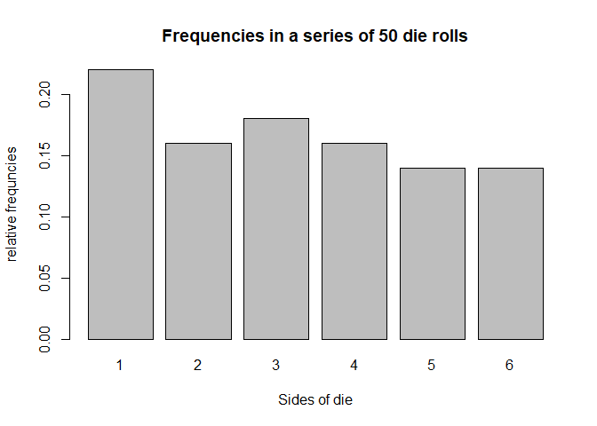

hw05-Minjeong-Jeong
================
Minjeong Jeong
2018/ 4/25

``` r
library(dieroller)
```

1) Object "die"
===============

``` r
fair_die <- die()
fair_die
```

    ## object "die"
    ## 
    ##   side      prob
    ## 1    1 0.1666667
    ## 2    2 0.1666667
    ## 3    3 0.1666667
    ## 4    4 0.1666667
    ## 5    5 0.1666667
    ## 6    6 0.1666667

``` r
# die with non-standard sides
weird_die <- die(sides = c('i', 'ii', 'iii', 'iv', 'v', 'vi'))
weird_die
```

    ## object "die"
    ## 
    ##   side      prob
    ## 1    i 0.1666667
    ## 2   ii 0.1666667
    ## 3  iii 0.1666667
    ## 4   iv 0.1666667
    ## 5    v 0.1666667
    ## 6   vi 0.1666667

``` r
# create a loaded die
loaded_die <- die(prob = c(0.075, 0.1, 0.125, 0.15, 0.20, 0.35))
loaded_die
```

    ## object "die"
    ## 
    ##   side  prob
    ## 1    1 0.075
    ## 2    2 0.100
    ## 3    3 0.125
    ## 4    4 0.150
    ## 5    5 0.200
    ## 6    6 0.350

``` r
# bad sides
bad_die <- die(sides = c('a', 'b', 'c', 'd', 'e'))
```

    ## Error in die(sides = c("a", "b", "c", "d", "e")): 
    ## 'sides must be of length 6

2) Object "roll"
================

``` r
# roll fair die 50 times
fair_die <- die()
# roll 50 times
set.seed(123)
fair_50rolls <- roll(fair_die, times = 50)
# print
fair_50rolls
```

    ## object "die"
    ## 
    ## $rolls: 
    ##  [1] 3 6 4 1 1 2 5 1 5 4 1 4 6 5 2 1 3 2 3 1 1 6 5 1 5 6 5 5 3 2 1 1 6 6 2
    ## [36] 4 6 3 3 3 2 4 4 4 2 2 3 4 3 1

``` r
# what's in fair50?
names(fair_50rolls)
```

    ## [1] "rolls" "sides" "prob"  "total"

``` r
fair_50rolls$rolls
```

    ##  [1] 3 6 4 1 1 2 5 1 5 4 1 4 6 5 2 1 3 2 3 1 1 6 5 1 5 6 5 5 3 2 1 1 6 6 2
    ## [36] 4 6 3 3 3 2 4 4 4 2 2 3 4 3 1

``` r
fair_50rolls$sides
```

    ## [1] 1 2 3 4 5 6

``` r
fair_50rolls$prob
```

    ## [1] 0.1666667 0.1666667 0.1666667 0.1666667 0.1666667 0.1666667

``` r
fair_50rolls$total
```

    ## [1] 50

3) Summary method for "roll" objects
====================================

``` r
set.seed(123)
fair_50rolls <- roll(fair_die, times = 50)
fair50_sum <- summary(fair_50rolls)
fair50_sum
```

    ## Summary "Roll" 
    ## 
    ##   side count prob
    ## 1    1    11 0.22
    ## 2    2     8 0.16
    ## 3    3     9 0.18
    ## 4    4     8 0.16
    ## 5    5     7 0.14
    ## 6    6     7 0.14

``` r
# what's in the summary
class(fair50_sum)
```

    ## [1] "summary.roll"

``` r
names(fair50_sum)
```

    ## [1] "freqs"

``` r
fair50_sum$freqs
```

    ##   side count prob
    ## 1    1    11 0.22
    ## 2    2     8 0.16
    ## 3    3     9 0.18
    ## 4    4     8 0.16
    ## 5    5     7 0.14
    ## 6    6     7 0.14

4) Plot methd for "roll" objects
================================

``` r
# plot method
plot(fair_50rolls)
```



5) Additional Methods
=====================

``` r
# roll fair die
set.seed(123)
fair_die <- die()
fair500 <- roll(fair_die, times = 500)
# summary method
summary(fair500)
```

    ## Summary "Roll" 
    ## 
    ##   side count  prob
    ## 1    1    80 0.160
    ## 2    2    81 0.162
    ## 3    3    92 0.184
    ## 4    4    92 0.184
    ## 5    5    72 0.144
    ## 6    6    83 0.166

``` r
# extracting roll in position 500
fair500[500]
```

    ## [1] 6

``` r
# replacing last roll
fair500[500] <- 1
fair500[500]
```

    ## [1] 1

``` r
summary(fair500)
```

    ## Summary "Roll" 
    ## 
    ##   side count  prob
    ## 1    1    81 0.162
    ## 2    2    81 0.162
    ## 3    3    92 0.184
    ## 4    4    92 0.184
    ## 5    5    72 0.144
    ## 6    6    82 0.164

``` r
# adding 100 rolls
fair600 <- fair500 + 100
summary(fair600)
```

    ## Summary "Roll" 
    ## 
    ##   side count      prob
    ## 1    1   100 0.1666667
    ## 2    2    97 0.1616667
    ## 3    3   104 0.1733333
    ## 4    4   109 0.1816667
    ## 5    5    91 0.1516667
    ## 6    6    99 0.1650000

``` r
# plot method
plot(fair500)
```


De Mere's problem
=================

Problem 1
---------

The first part of the problem involves computing the probability of getting at least one "6" in four rolls of die.

``` r
library(dieroller)

set.seed(123)
series <- 0
for (i in 1:1000) {
  if(sum((roll(die(), times = 4)$rolls) == 6) != 0) {
    series  <- 1+series 
  }
}
series /1000
```

    ## [1] 0.527

``` r
1-(5/6)^4
```

    ## [1] 0.5177469

Problem 2
---------

The other problem involves computing the probability of getting at least two “6” in 24 rolls of a pair of dice. This probability can be computed analytically as:

``` r
set.seed(123)

series2 <- 0
for (i in 1:1000) {
  for (i in 1:24) {
    if((sum(roll(die(), times = 2)$rolls) == 12)) {
      series2 <- series2 + 1
      break
    }
  }
}

series2/1000
```

    ## [1] 0.461

``` r
1-(35/36)^24
```

    ## [1] 0.4914039

\`\`\`
